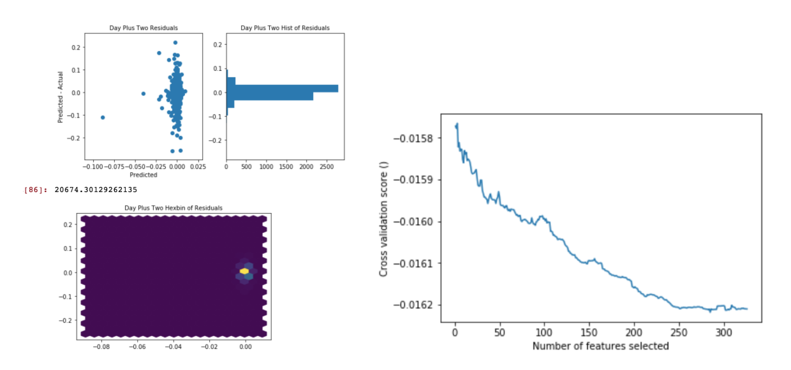

# time_series

This was a suggested takehome challenge from a company I interviewed with in May 2018

Given time series data (price, and a whole bunch of masked features)for:

T-2day, T-1day, T-0m - T-120m

Predict 

T-121m - T180m, T+1day, T+2day

Skills that are highlighted:
- feature engineering
    - via residuals
    - via exhaustive recursive feature selection

- Models tried
    - Linear Regression
    - RandomForest

This problem is HARD. I wasn't able to pull signal out of this. I suspect that if I was able to I would be rich though :-|. 

It certainly heated up my feature engineering skills!

