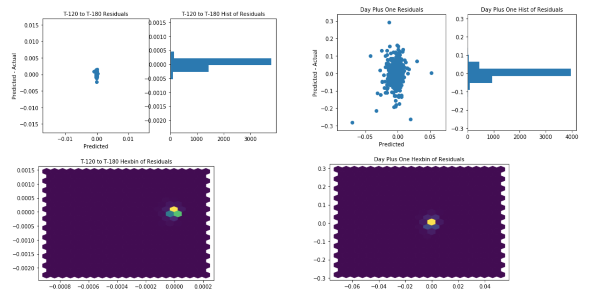

# time_series

This was a suggested takehome challenge from a company I interviewed with in May 2018

Given time series data (price, and a whole bunch of masked features)for:

T-2day, T-1day, T-0m - T-120m

Predict 

T-121m - T180m, T+1day, T+2day

Skills that are highlighted:
- feature engineering
    - via residuals
    - via exhaustive recursive feature selection

- Models tried
    - Linear Regression
    - RandomForest

This problem is HARD. I wasn't able to pull signal out of this. I suspect that if I was able to I would be rich though :-|. 

It certainly heated up my feature engineering skills!

# Residuals and plot of recursive feature elimination
- The three residuals plots reading from left to right and top to bottom are: T-120m through 1-180m, T+1day, and T+2day residuals.
    - the hexbins I found helpful because scatter plots can lose some sense of density

- The plot on the bottom right shows the improvement (from right to left) when I just gave up and used recursive feature elimination. 
- Before you ask "Why didn't you try a decision tree based model?". I did, it's in there. I just cut it short when my WMAE score for RF regression was through the roof for it's first pass. 

# I want to see the code though:
EDA Winton 2.ipynb

Thanks for reading!

